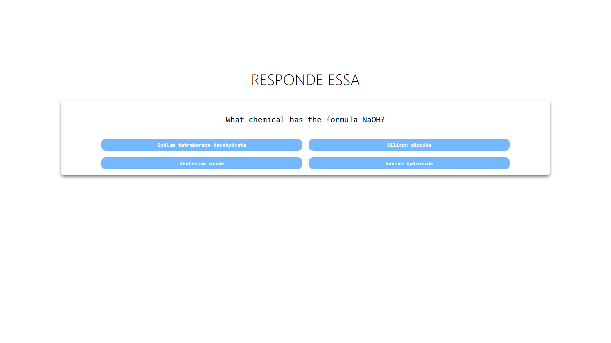

<h1 align="center">
   Quiz app
</h1>

## 
 <u>Preview da página:</u> 

  

> A página se comporta como um jogo de quiz, requisitando as trívias a uma api pública e exibindo-as.

<h4 align="center"><a href="" target="_blank">Clique para visitar o projeto</a></h4>

---
# 💼 Tecnologias Utilizadas

As seguintes ferramentas foram usadas na construção do projeto:

- Html
- Css
- ReactJS

*Também foram aplicados conceitos de responsividade*

# ⚙️ Instalação

### Client

  1. `$ cd client`
  2. `$ npm install`
  3. `$ npm start`
 
# 🛠️ Funcionalidades

- Criar tarefas no banco de dados
- Ler as tarefas armazenadas no banco de dados

# 🔧 Bibliotecas

### Front-end

- `React`
- `Axios`

---

### Ajustes e melhorias

O projeto ainda está em desenvolvimento e as próximas atualizações serão voltadas nas seguintes tarefas:

- [ ] Traduzir, encontrar ou desenvolver uma api de trívias em português.

---

Feito por Thauã Magalhães 👋🏽 Entre em contato!

 

